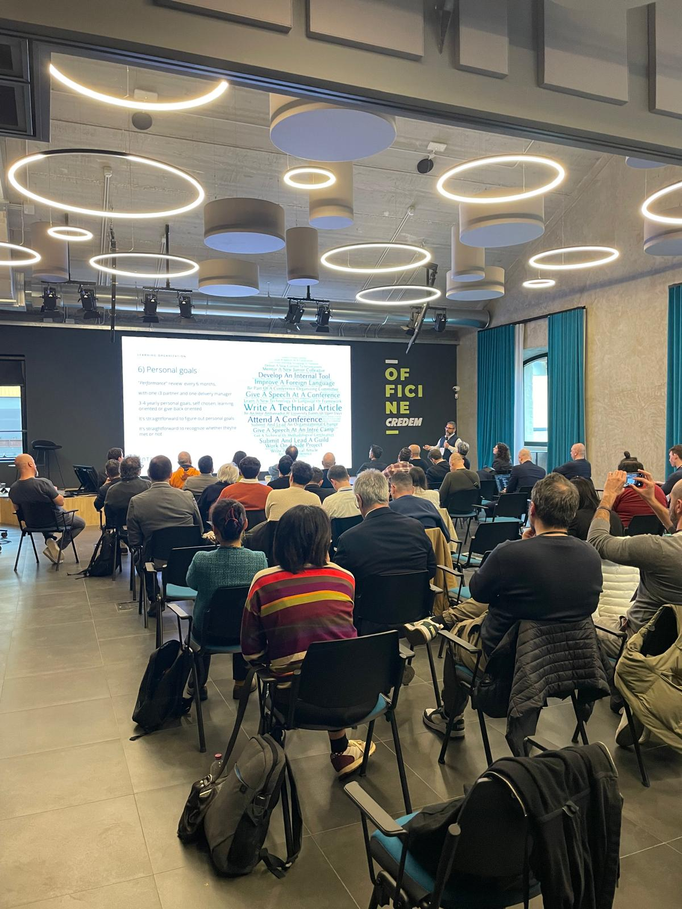
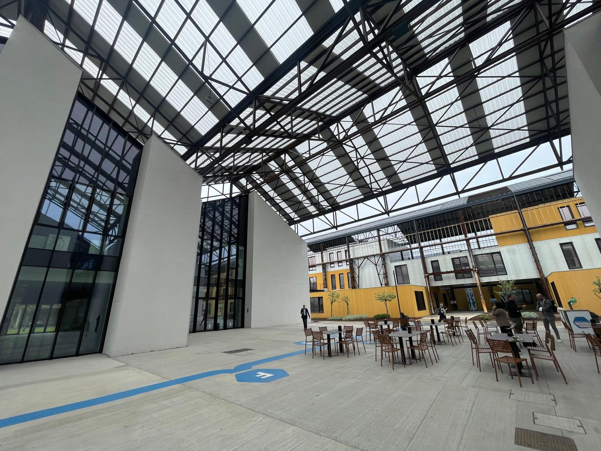
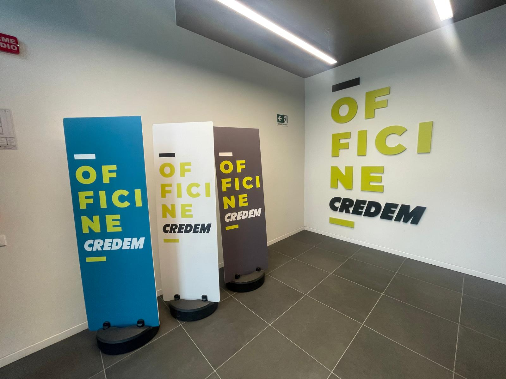
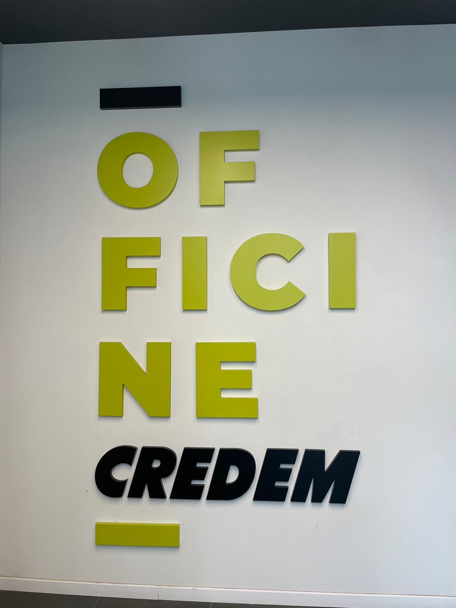
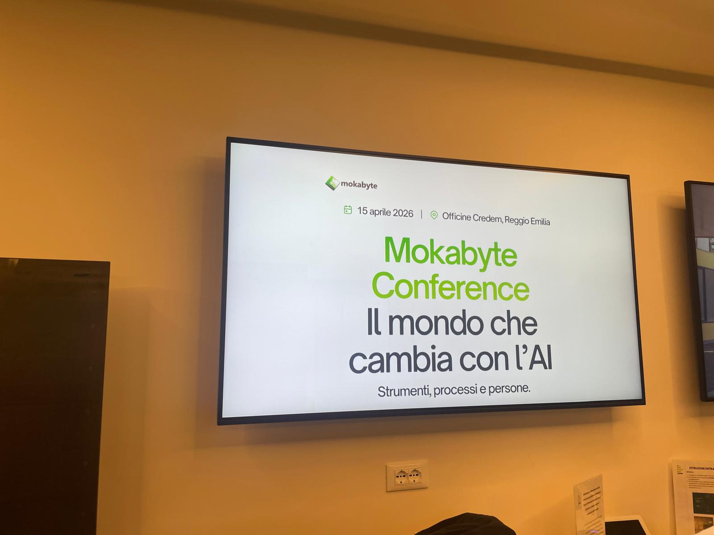
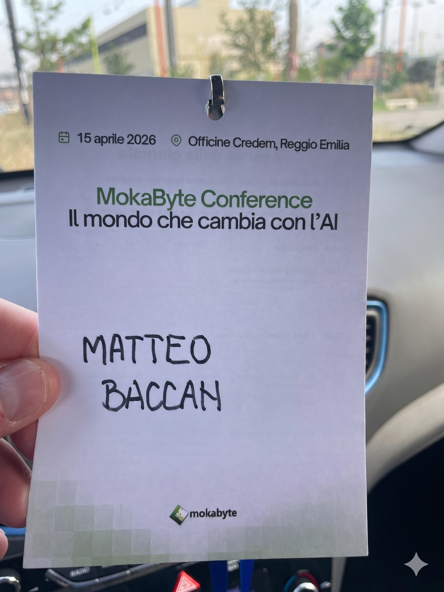

# Il Vibecoding è morto: viva lo Spec-Driven Development

In questo repository raccolgo la mia presentazione "Il Vibecoding è morto: viva lo Spec-Driven Development", che ho portato alla **MokaByte Conference 2026**.

Nella versione da 30 minuti ho compattato il titolo in **"Basta Vibecoding: viva lo Spec-Driven Development"**, mantenendo gli stessi contenuti chiave.

## 📅 MokaByte Conference 2026

**15 Aprile 2026 - Officine Credem (RE)**  
Tema dell'evento: **Il mondo che cambia con l'AI**

La conferenza finale prevede interventi frontali da parte degli autori della rivista, con organizzazione **multitrack** per permettere a tutti di seguire i temi di maggiore interesse.

### Partecipazione

Partecipazione gratuita con **registrazione obbligatoria** fino a esaurimento posti disponibili.

### Programma della giornata

| Orario | Sessione | Speaker |
|:---|:---|:---|
| 8.30 - 9.15 | Registrazione | - |
| 9:15 - 10.15 | MokaByte da 30 anni all'avanguardia | Claudio Bergamini, Fabrizio Giudici, Giovanni Puliti |
| 10:15 - 11:00 | Road to Cloud - Una guida strategica alla trasformazione | Giovanni Mazzapioda (ABILab), Filippo Bosi (Imola Informatica) |
| 11.00 - 11.30 | Pausa caffè | - |
| 11:30 - 12:15 | Learning Organizations | Alessandro Giardina (Intré) |
| 12:15 - 13:00 | Tutto quello che sapevi sullo sviluppo prodotto è già cambiato | Stefano Leli (Agile Reloaded) |
| 13:00 - 14:30 | Pausa pranzo | - |
| 14:30 - 15:15 | Dai modelli linguistici agli agenti IA: tra sicurezza e compliance | G. Mattietti, A. Proscia (Imola Informatica) |
| 14:30 - 15:15 | Quando l'AI capisce davvero: Knowledge Graph come libretto delle istruzioni per LLM e agenti | M. Busanelli (BitBang) |
| 14:30 - 15:15 | AI e futuro del lavoro: chi viene sostituito, chi viene trasformato | M. Calzolari (Agile Reloaded) |
| 15:15 - 16:00 | Basta Vibecoding, viva lo Spec-Driven Development | Matteo Baccan |
| 15:15 - 16:00 | Quando l'AI entra in azienda: sfide e nuovi equilibri | Luca Vetti Tagliati |
| 15:15 - 16:00 | Governare e dipendere? Dati e AI nella sfida della sovranità tecnologica | Luca Foschini |
| 16:00 - 16:30 | Pausa caffè | - |
| 16.30 - 17:15 | Tavola rotonda | - |

### Focus tematici principali

* Trasformazione cloud nel banking, architetture modulari e governance.
* Learning & Development aziendale con modelli strutturati di apprendimento continuo.
* Evoluzione del product development con agenti AI specializzati.
* Sicurezza, compliance e implicazioni normative nell'adozione di LLM e agenti.
* Knowledge Graph, ontologie e GraphRAG per ridurre allucinazioni e aumentare explainability.
* Impatto dell'AI su ruoli professionali, organizzazione del lavoro e competenze.
* Metodologie di sviluppo AI-assisted: dai limiti del vibecoding allo Spec-Driven Development.
* Governance dei dati, etica, privacy e sovranità tecnologica in contesti data-driven.

## 📄 Versioni della Presentazione

| File | Durata | Slide contenuto | Note |
|:---|:---|:---|:---|
| `presentation.md` | ~50 min | ~90 | Versione completa con tutti gli approfondimenti |
| `presentation30min.md` | ~30 min | ~50 | Versione compatta ottimizzata per slot da 30 minuti |

In entrambe le versioni includo 3 slide appendice, non presentate dal vivo, con link e risorse per chi scarica le slide dopo l'evento.

## 📄 Contenuti della Presentazione

In questa presentazione esploro i limiti dell'approccio "Vibecoding" (programmare a sentimento con l'AI) e propongo lo **Spec-Driven Development (SDD)** come metodologia professionale per lo sviluppo software assistito da AI.

### Punti Chiave

1. **Il Problema del Vibecoding**:
    * Parto dall'illusione di produttività data dagli script generati al primo colpo.
    * Mostro i problemi di scalabilità su sistemi Enterprise e legacy.
    * **Context Rot**: evidenzio come l'AI perda il filo e generi codice incoerente o allucinato man mano che la chat si allunga.
    * Metto a fuoco le allucinazioni verosimili: il rischio peggiore sono le risposte *credibili* ma tecnicamente sbagliate.

2. **Spec-Driven Development (SDD)**:
    * Propongo un modello in cui le specifiche (in Markdown) diventano artefatti eseguibili.
    * Mostro l'AI come implementatore che segue un contratto preciso.
    * Evidenzio i vantaggi: Tracciabilità, Riproducibilità, Zero Context Rot.
    * Sostengo che il ruolo dello sviluppatore cambi: da scrittore di sintassi ad **Architetto di Specifiche**.

3. **Framework e Strumenti**:
    * Presento **BMAD** per contesti Enterprise complessi, con 21 agenti specializzati.
    * Inserisco **GSD (Get Shit Done)** per sviluppatori singoli che vogliono velocità.
    * Cito **GitHub Spec Kit** come standard open source per l'ecosistema GitHub.
    * Richiamo **Ralph Loop / Agent.OS** per flussi CI/CD autonomi basati su "Git as Memory".
    * Porto **CodeSpeak** come esempio radicale di linguaggio e workflow "spec-first" (AI-native).

4. **Workflow Pratico in 5 Step**:
    * Descrivo l'inizializzazione della cartella `.spec/` con contesto e convenzioni.
    * Spiego il drafting iterativo dei requisiti con l'AI.
    * Mostro la generazione della specifica tecnica con checkpoint umano.
    * Porto il breaking down in task atomici e testabili.
    * Chiudo con il loop di implementazione con l'Agente AI.

5. **Applicazioni Concrete**:
    * Porto il caso di SDD su legacy code da 50.000 righe: analisi, protezione con test, refactoring incrementale.
    * Collego il metodo a conformità e documentazione, tra GDPR, ISO 9001 e AI Act.
    * Ragiono sul ROI: riduzione dei tempi di debugging, efficienza token, onboarding più rapido.
    * Richiamo il **Benchmark SWE-CI** come valutazione della manutenibilità a lungo termine, che rende l'SDD una necessità concreta.

## 🛠️ Tool Utilizzati

Per realizzare questa presentazione ho usato:

* **BGE** (Brigata dei Geek Estinti) — Puntata 98 e 99 per gli spunti
* **Gemini** — Per la riformattazione
* **Nano Banana Pro** — Per le immagini
* **Claude** — Per la prima scaletta
* **NotebookLM** — Per i riassunti dei podcast e video
* **Antigravity** — Per gestire il progetto GitHub
* **Marp** — Per la generazione delle slide
* **Dario Ferrero** — Per l'analisi di CodeSpeak (<https://aitalk.it/>)

## 👤 Speaker

**Matteo Baccan**

* Sito web: [baccan.it](https://www.baccan.it)
* Quote: *"Smetti di chattare, inizia a governare."*

## 📸 Foto Evento

Qui raccolgo alcune foto dell'evento e della venue.

### Sala e venue

### Segnaletica e contenuti

### Badge speaker

