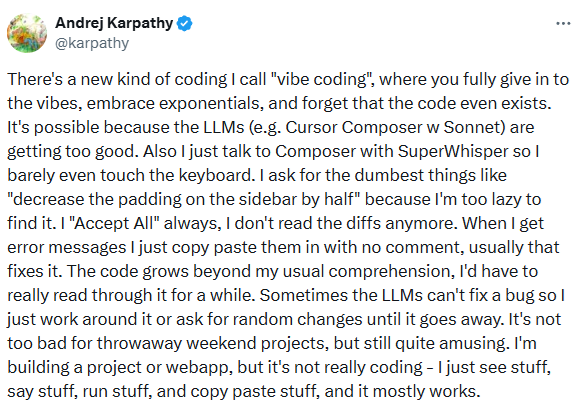

<!-- class: lead -->

# Il Vibecoding è morto: viva lo Spec-Driven Development

## Come domare gli Agenti AI con le specifiche e smettere di riscrivere codice

**Speaker:** Matteo Baccan
**Evento:** MokaByte Conference

---

<!-- _header: '' -->
<!-- _class: section-title -->
<!-- _backgroundImage: url('img/sezione1.webp') -->
<!-- _paginate: false -->
<!-- _footer: "" -->

---

# SPOILER: è tutta colpa di Andrej Karpathy

- Co-fondatore di **OpenAI**, ex Direttore AI di **Tesla** (Autopilot)
- Creatore di corsi e video tra i più seguiti al mondo su reti neurali e LLM
- Noto per il suo stile provocatorio e ironico: lancia idee volutamente esagerate per accendere il dibattito
- Nel gennaio 2023 twitta: *"The hottest new programming language is English"* — tweet virale con 10M+ visualizzazioni che scatena il panico tra gli sviluppatori e titoloni clickbait tipo *"I programmatori sono finiti"*
- A febbraio 2025 rincara la dose e conia il **"Vibe Coding"**: *"accetto tutto, non leggo il codice, se non funziona chiedo fix random finché passa"* — detto con il sorriso, preso sul serio da mezzo internet

---

<!-- _header: '' -->
<!-- _paginate: false -->
<!-- _footer: "" -->

<div style="display:flex;justify-content:center;align-items:center;height:100%;">



</div>

---

## ECCE BOMBO

# "Faccio cose, vedo gente"

Nanni Moretti ci perculava già anni fa

---

# La promessa dell'AI Coding

- Tutti abbiamo provato quel brivido: chiedi a Claude o ChatGPT di scrivere uno script Python da zero.
- Risultato: Funziona al primo colpo.
- La sensazione: "Siamo tutti sviluppatori 10x adesso".
- **La realtà:** Funziona bene per script usa-e-getta, FALLISCE su sistemi complessi e legacy.
- Spoiler: **non scala.** E vi mostro perché.

---

# Un test veloce (alzate la mano)

- 🙋 **Chi ha provato il Vibecoding?** (Claude, Copilot, GPT, Cursor…)
- 🙋 **Chi ha generato un progetto intero con l'AI?**
- 🙋 **Chi ha poi buttato tutto e riscritto da zero?**

Se avete alzato la mano tutte e tre le volte, questo talk è per voi.

---

# Il mito del "zero-to-prod"

- Sì, le demo funzionano davvero. Il problema inizia al secondo mese.
- Il codice generato sembra brillante, poi diventa **ingestibile**.
- Senza specifiche, il debugging costa più della scrittura.
- **Esempio reale:** app CRUD generata → login ok, ma permessi rotti, CORS in errore e 500 in produzione.

---

# Cos'è il "Vibecoding"?

- **Definizione:** Scrivere codice "a sentimento", sperando che l'AI indovini le nostre intenzioni.
- **Workflow:** Prompt ad-hoc → Copia/Incolla → Fix rapidi → Ripeti.
- Lo vedremo meglio dopo: ha i suoi spazi legittimi, ma non è per tutto.

---

# La tesi di questo talk

- Il vibecoding non è morto in assoluto — è morto come **unico** approccio.
- **Smettere di chattare col tuo IDE. Iniziare a governare l'AI con specifiche strutturate.**
- Vi mostro un metodo che trasforma l'AI da assistente imprevedibile a esecutore governabile: lo **Spec-Driven Development (SDD)**.
- Ma prima, vediamo i problemi concreti che lo rendono necessario.

---

# La realtà del software Enterprise

- Il 70% degli sviluppatori lavora su codebase con oltre 5 anni di vita. Non su greenfield.
- Cosa succede quando il sistema è un gestionale legacy di 50.000 righe?
- O quando devi integrare una nuova feature in un'architettura a microservizi?
- Qui il "Vibecoding" mostra le sue crepe strutturali.

---

# Il killer silenzioso: Context Rot

- **Context Rot (Marciume del contesto):** Più token in input = meno affidabilità in output.
- Più la chat si allunga, più l'AI "dimentica" le decisioni iniziali e ignora vincoli critici.
- **Il risultato:** Codice incoerente, allucinazioni architetturali, vulnerabilità di sicurezza.
- **Antidoto:** task piccoli, sessioni "fresh start", specifiche brevi e ripetibili.

---

# Context Engineering (regola pratica)

- **Regola empirica:** se il prompt supera il 60% della context window, aspettati degradazione.
- **Strategia:** task piccoli, sessioni "fresh start". Tieni i task sotto il 30%.
- Specifiche brevi e ripetibili battono chat infinite.
- **Esempio:** 1 task = 1 endpoint + test; poi nuova sessione.

---

# L'architettura emergente (in negativo)

- Senza una visione globale, il codice cresce in modo caotico.
- "Architettura spaghetti" generata dall'AI.
- **Esempio:** 3 sessioni di chat diverse generano 3 modi diversi di gestire gli errori nello stesso progetto. Nessuno sa qual è quello "giusto".
- **Mancanza di tracciabilità:** Perché l'AI ha scelto quella libreria? Non c'è scritto da nessuna parte se non in una chat persa.

---

# Il peso delle Allucinazioni

- Quando il contesto è "sporco" o ambiguo, l'AI riempie i vuoti con **assunzioni plausibili, ma errate**.
- **Esempio reale 1:** Un modello ha inventato intere classi e metodi per risolvere integrazioni mancanti.
- **Esempio reale 2:** Generazione di file da 1.500 righe ingestibili anziché architettura modulare.
- **La conseguenza:** Debuggare codice AI scadente richiede spesso più tempo che riscriverlo da zero.

---

# La trappola delle allucinazioni verosimili

- Il problema peggiore non è l'errore evidente.
- **Il vero rischio:** risposte *credibili* ma tecnicamente sbagliate.
- Il codice sembra corretto, passa la review superficiale, ma introduce bug sottili.
- **Esempio:** AI genera validazione email con regex che accetta `user@.com`. Sembra corretta. 200 utenti si registrano con email invalide prima che qualcuno se ne accorga.

---

# La difficoltà di Onboarding

- Nuovo dev entra nel team. Chiede: "Perché usiamo Redis qui e non Memcached?"
- Risposta: "Era in una chat di 3 mesi fa, cerca tu."
- Risultato: il nuovo dev riscrive tutto con Memcached. Due sistemi di cache, zero documentazione.
- **Manca una "Source of Truth" persistente.**

---

<!-- _header: '' -->
<!-- _class: section-title -->
<!-- _backgroundImage: url('img/sezione2.webp') -->
<!-- _paginate: false -->
<!-- _footer: "" -->

---

# Se il prompt è una richiesta, la specifica è un contratto.

> L'AI non deve **indovinare** cosa vuoi.
> Deve **eseguire** quello che hai specificato.

---

# Definizione di SDD

- **Spec-Driven Development:** Una metodologia dove le specifiche diventano artefatti eseguibili di prima classe.
- Non scrivi codice. Scrivi il "contratto" (la specifica).
- L'AI genera il codice rispettando quel contratto.
- **Se il prompt è una richiesta, la specifica è un contratto.**

---

# I tre pilastri dello SDD

1. **Specifica come Fonte di Verità:** Ogni decisione è documentata in file persistenti (Markdown).
2. **Tracciabilità:** Le modifiche alle specifiche si propagano ai task e all'implementazione.
3. **Riproducibilità:** La stessa specifica produce output verificabili contro criteri noti, anche se non identici bit-per-bit.

---

# Come l'SDD riduce le Allucinazioni

Non elimina le allucinazioni. Le **contiene e rende visibili**.

1. **Ancore Semantiche:** La specifica è un punto di riferimento costante che "ancora" l'AI alla realtà.
2. **Riduzione dello Spazio di Ricerca:** Specificando librerie e pattern riduci opzioni da migliaia a poche.
   - ❌ Vago: "Fammi un login"
   - ✅ Preciso: "JWT HS256, 1h scadenza, PostgreSQL, niente OAuth"
3. **Verifica in Due Fasi:** L'AI pianifica in "Plan Mode" e poi chiede approvazione prima di agire.
   - Revisione umana riduce errori e deviazioni dalla specifica.
4. **Separazione Responsabilità:** AI genera, tu validi contro spec. Differenza chiarissima se il codice devia.

---

# Markdown è la nuova UI

- Non servono tool proprietari complessi.
- Usiamo Markdown strutturato.
- **Perché?** È leggibile dagli umani ed è la lingua madre degli LLM.
- **Riduce i costi dei token:** L'AI legge un file strutturato, non 100 messaggi di chat confusi.

---

# Non è il vecchio "Waterfall"?

- **Critica comune:** "Sembra di tornare alla documentazione pesante anni '90".
- **Risposta:** No, è iterativo.

| | Waterfall | SDD |
|:---|:---|:---|
| **Ciclo** | Spec → Build → Ship (mesi) | Spec → Build → Review → Spec (ore) |
| **Feedback** | A fine progetto | Dopo ogni task |
| **Modifica spec** | Costosa | Normale |

---

# Markdown Strutturato: Best Practices

**Lo scheletro:**
```markdown
## OBIETTIVO
Cosa deve fare (1 riga chiara)
## NON-GOAL
Cosa NON deve fare (importantissimo!)
## CONTENUTI TECNICI
- Stack / Librerie vietate / Performance
## OUTPUT ATTESO
- [ ] Test Case 1
- [ ] Backward compatibility
## CONTEXT
Solo codice rilevante (max 500 righe)
```

---

## Regole d'oro per Markdown Strutturato

- ✅ Conciso: <300 righe se possibile
- ✅ Eseguibile: L'AI dovrebbe poter dire "sì, posso farlo"
- ✅ Falsificabile: Si vede subito se il codice generato lo rispetta
- ✅ Se basta una regex, **non usare un LLM**
- ❌ Lungo: Non copiare l'intero sistema
- ❌ Vago: "Migliora il codice" non è una specifica

---

# L'Anatomia di una Specifica AI

- Non è un PRD per Product Manager (umani). È un documento di esecuzione per Agenti.
- **Contiene:** Contesto, Vincoli (cosa _non_ fare), Librerie permesse, Task atomici.
- **Per un umano:** `"Voglio un sistema di login sicuro"` → ❌ Ambiguo. L'AI indovina tutto.
- **Per un agente AI?** Vediamo ↓

---

# Anatomia di una Specifica AI (vs Uomo)

**Per AI (SDD):**
```markdown
## OBIETTIVO
Implementare autenticazione JWT con scadenza 1 ora.

## VINCOLI
- Token: JWT (HS256)
- Scadenza: 1h access + 7gg refresh
- Database: PostgreSQL
- NON USARE: OAuth, librerie terze non approvate

## OUTPUT ATTESO
- [ ] Test passa (coverage definita nella spec)
- [ ] API /auth/login ritorna 200
- [ ] Token payload contiene: user_id, scopes
```
✅ Deterministico. Niente sorprese.

---

# Il cambio di ruolo dello sviluppatore

- Da "scrittore di sintassi" a **Architetto di Specifiche** e **Reviewer**.
- Il valore aggiunto non è più ricordare la sintassi di Python, ma definire _cosa_ costruire e _come_ verificare che sia corretto.
- **Concretamente:** nel prossimo sprint, il deliverable non è il codice. È la specifica validata. Il codice è un effetto collaterale.

---

# Vantaggi immediati dello SDD

**Controllo:**
- Meno Context Rot: ogni sessione parte da file puliti (non da 100 messaggi di chat).
- Tracciabilità: ogni pezzo di codice ha radice nella specifica versionata con Git.
- Revertibilità: commit Git basati su task specifici. Rollback atomico.

**Efficienza:**
- Parallelismo: più agenti lavorano su specifiche diverse senza conflitti.
- Costo Token: Markdown strutturato riduce rumore rispetto a chat lunghe.

**Qualità:**
- Output più stabile e verificabile. Compliance e documentazione più facili.

---

# Quando usare SDD (e quando no)

- **SÌ:** Progetti greenfield, feature complesse, team distribuiti, settori regolamentati (es. Finance).
- **NO:** Bug fix rapidi, prototipi "usa e getta", modifiche UI minori.

---

<!-- _header: '' -->
<!-- _class: section-title -->
<!-- _backgroundImage: url('img/sezione3.webp') -->
<!-- _paginate: false -->
<!-- _footer: "" -->

---

# Il panorama dei Framework SDD

- Non esiste un solo modo. Il mercato sta esplodendo.
- Ma prima di tutto: **la chiave è la disciplina, non il tool.**
- Si può fare "SDD artigianale": un file `PROJECT.md`, un `TASKS.md` e un prompt che dice "Leggi PROJECT.md, esegui il prossimo task".
- I framework aiutano a scalare. Vediamone tre.

---

# Agenti vs Workflow Deterministici

- **Workflow/RPA:** Passaggi lineari e noti a priori.
- **Agenti:** Discrezionalità esplorativa, il passo successivo dipende da ciò che scoprono.
- **Esempio:** Ricerca su fonti aperte/legali = agente; ETL schedulato = workflow.

---

# BMAD Method (Build More, Architect Dreams)

- **Target:** Enterprise, Team Complessi.
- **Concetto:** Simula un intero team Agile con 21 agenti specializzati (PM, Architetto, Dev, QA).
- **Workflow:** Analisi → Piano → Storie → Implementazione → QA.
- **Caso studio (simulato):** Migrazione legacy 50k righe COBOL → Java — 40% riduzione tempi integrazione, zero regressioni grazie ai test generati dalle specifiche.

---

# GSD (Get Shit Done)

- **Target:** Solo Developer, "Anti-Burocrazia".
- **Filosofia:** "La complessità è nel sistema, non nel workflow".
- **Struttura:** 3 Task massimo per piano. Sub-agenti "puliti" per evitare context rot.
- **Funnel:** Planning Prompt (gap analysis) → Building Prompt (task + test + commit) → Loop.
- **Claim dell'autore:** 100k righe in 2 settimane da un solo dev (il punto è la velocità del ciclo, non il numero assoluto).

---

# Pattern: "Squadrone di stagisti"

- Non un agente generalista, ma **molti agenti piccoli** con carico cognitivo limitato.
- Ogni agente si occupa di un dominio specifico (es. NuGet, Brew, npm).
- Un agente "manager" coordina e valida i risultati.
- Risultato: sistema scalabile, testabile, governabile.

---

# GitHub Spec Kit

- **Target:** Lo standard Open Source (supportato da GitHub).
- **Integrazione:** Funziona con Copilot, Claude Code, Gemini.
- **Comandi:** `/specify` (genera spec), `/plan` (genera piano tecnico), `/tasks` (genera lista task), `/implement`.

---

# Il workflow di Spec Kit

1. **Specify:** Definisci l'intento (What & Why).
2. **Plan:** Piano tecnico, stack, vincoli architetturali (How).
3. **Tasks:** AI rompe il piano in task implementabili e testabili.
4. **Implement:** L'agente esegue un task alla volta.

---

# OpenSpec: loop minimale, molto pratico

- **Init:** genera struttura e `PROJECT.md` nel repo.
- **Proposal:** per ogni feature crea change con proposta + task list + spec.
- **Review:** checkpoint umano sui file prima di toccare il codice.
- **Apply:** implementazione guidata della singola change.
- **Archive:** chiudi la change e riparti con la successiva.
- In pratica funziona bene perché impone un ciclo chiaro: *spec → review → code → done*.

---

# Quando il framework diventa frizione

- Se passi più tempo a seguire il rituale che a validare il risultato, sei in over-process.
- **Segnali tipici:** troppe fasi prima del primo commit utile, nomenclatura rigida, comandi da ricordare invece di decisioni da prendere.
- Su progetti piccoli/medi: meglio processo leggero e file chiari, senza burocrazia extra.
- Su progetti grandi/regolati: la struttura più forte può valere il costo.

---

# Ralph Loop / Agent.OS

- **Concetto:** "Git as Memory".
- Invece di mantenere il contesto nella chat, l'agente esegue un loop: Legge Spec → Fa Task → Committa → Muore → Rinasce.
- Abbraccia il "Fresh Start" per ogni task.
- Ottimo per CI/CD autonomi.

---

# Confronto Framework SDD

| Framework | Complessità | Target | Punti di Forza |
| :--- | :--- | :--- | :--- |
| **BMAD** | Alta | Full Enterprise | 21 agenti specializzati |
| **GSD** | Bassa | Developer Veloce | Anti-burocrazia, sub-agenti puliti |
| **GitHub Spec Kit** | Media | Standard Industry | Open-source, integrazione Copilot |
| **Ralph Loop** | Media | CI/CD Autonomi | "Git as Memory", fresh start |

---

# Framework agentici (non SDD)

| Framework | Complessità | Quando usarlo | Nota |
| :--- | :--- | :--- | :--- |
| **LangGraph** | Alta | Progetti enterprise grandi | Potente, curva ripida |
| **Agno (ex Phidata)** | Bassa | Prototipi e team piccoli | Python semplice, debug veloce |

---

# Strumenti e IDE

- **Terminal-based:** Claude Code, Aider.
- **IDE-based:** Cursor (con `.cursorrules`), Windsurf.
- **Importante:** Il framework deve essere indipendente dall'IDE se possibile.
- Tutti convergono su file `.md` strutturati: Diffable, Leggibile, Portabile.
- Non usate formati proprietari.

---

# CodeSpeak: mantenere le specifiche, non il codice

- Progetto di **Andrey Breslav** (creatore di Kotlin): non un plugin, ma un tentativo di ripensare il rapporto tra umani, codice e agenti AI.
- Idea chiave: il team mantiene file di specifica leggibili; il codice di implementazione viene rigenerato dal sistema.
- Workflow dichiarativo: scrivi `.cs.md` → lanci `codespeak build` → il codice viene aggiornato e verificato contro i test.
- Approccio pragmatico: **mixed mode** per convivere con codice scritto a mano, **takeover** per estrarre una spec da moduli legacy esistenti.

---

# Perché CodeSpeak conta nel dibattito SDD

- È un segnale forte: non solo framework e prompt migliori, ma **linguaggi AI-native** pensati per specificare l'intento.
- Nei case study pubblicati, alcune porzioni di codice si comprimono di circa **6x-10x** mantenendo il comportamento verificato dai test.
- Il punto interessante non è "scrivere meno"; è spostare review, versioning e governance sulla **specifica eseguibile**.
- Però: è ancora **Alpha**, oggi lavora solo su Python, usa LLM esterni, e porta con sé rischi di lock-in e debug più opaco.

---

# Dove andiamo
## (e dove non siamo ancora)

- **Attenzione:** Tutto ciò che vedete oggi è lo stato dell'arte *di questo momento*. Il movimento è rapidissimo.
- Ogni 3-6 mesi emergono nuovi framework, nuovi pattern, nuove capacità degli LLM.
- I progressi sono **costanti e continui**: non siamo ancora all'apice. La curva non si è appiattita.
- **Direzione chiara dei framework:**
  - Da "prompt singolo" → **specifiche strutturate come contratto**
  - Da "un agente tuttofare" → **squadre di agenti specializzati coordinati**
  - Da "chat come memoria" → **Git e file come memoria persistente**
  - Da "IDE plugin" → **integrazione nativa nell'intero ciclo CI/CD**
- I tool che vi ho mostrato (BMAD, GSD, Spec Kit, Ralph Loop) potrebbero essere superati tra 6 mesi. Ma il **principio fondamentale** — governare l'AI con specifiche — resterà.

---

# Investite nella disciplina, non nel tool

> I tool cambiano ogni 6 mesi.
> Il metodo resta.
> La capacità di specificare è il vostro vantaggio competitivo.

---

<!-- _header: '' -->
<!-- _class: section-title -->
<!-- _backgroundImage: url('img/sezione4.webp') -->
<!-- _paginate: false -->
<!-- _footer: "" -->

---

# Step 1 - L'Inizializzazione

- Creare la cartella `.spec` o `docs/`.
- Inserire il contesto globale: Tecnologie, Convenzioni di Codice.

```
progetto/
├── .spec/
│   ├── PROJECT.md      ← Contesto globale
│   ├── CONVENTIONS.md  ← Regole (snake_case, no lib esterne...)
│   └── specs/
│       └── SPEC-001.md ← Prima feature
└── src/
```

---

# Step 2 - Definire l'Intento (Drafting)

- Non scrivere prompt tecnici subito.
- Dialogo con l'AI per esplorare i requisiti.
- **Esempio:** "Aiutami a progettare una feature per analizzare video YouTube". L'AI fa domande chiarificatrici (Edge cases? Error handling?).

---

# Raffinamento dei prompt come processo

- Un buon prompt nasce da **domande iterative**, non da un colpo solo.
- La specifica diventa il filtro contro ambiguità e allucinazioni.

```
Tu:  "Genera export CSV degli ordini"
AI:  "Quale delimitatore? Encoding? Include PII? Max righe?"
Tu:  "Virgola, UTF-8, no PII, max 50k righe per file"
→ Specifica completa in 2 minuti, non in 2 ore
```

---

# Step 3 - Generare la Specifica Tecnica

- L'AI trasforma le risposte in un documento `SPEC-001.md`.
- **Include:** Obiettivi, Non-Goals, API Contract, Schema Database.
- **CHECKPOINT UMANO:** Qui ti fermi e leggi. Se la spec è sbagliata, il codice sarà sbagliato. Correggi il Markdown, non il codice.

---

# Step 4 - Breaking Down (I Task)

- Chiedi all'AI: "Rompi questa specifica in 10 task atomici".
- **Regola d'oro:** Ogni task deve essere testabile e committabile singolarmente.
- **Esempio:** "1. Crea modello DB", "2. Crea API Endpoint", "3. Aggiungi Test".

---

# Pipeline team "leggera"
## (senza framework rigido)

- `PROJECT_DESCRIPTION.md`: requisito cliente + vincoli tecnici.
- `USER_STORIES.md`: traduzione in storie approvabili dal business.
- `DATABASE_SCHEMA.md`: checkpoint separato prima dei task.
- `PROJECT_PHASES.md`: task numerati, stato (`not started` / `partial` / `done`).
- L'implementazione procede in linguaggio naturale: "lavora sul task 1.1 e aggiorna lo stato".

---

# Perché separare User Stories e Database

- Le user stories allineano aspettative e priorità con stakeholder non tecnici.
- Lo schema dati influenza decisioni architetturali a valle: meglio fissarlo presto.
- Sequenza efficace: **storie → schema DB → task eseguibili**.
- Risultato: meno refactor costosi e meno divergenze tra piano e codice.

---

# Step 5 - Implementazione (Il Loop)

- **Comando all'Agente:** "Esegui Task 1 seguendo SPEC-001.md".
- L'Agente legge la spec, scrive il codice, fa passare i test.
- Tu fai la review del codice generato.

---

# L'importanza del "Plan Mode"

- Molti tool (es. Claude Code) hanno ora un "Plan Mode".
- SDD è essenzialmente un "Plan Mode" persistente e scalabile su tutto il progetto, non solo sulla singola richiesta.
- L'AI pianifica, poi chiede approvazione prima di agire.

---

# Orchestrazione: sincrono vs asincrono

- **Errore comune:** far comunicare gli agenti in modo sincrono.
- **Conseguenza:** blocchi, colli di bottiglia, scarsa scalabilità.
- **Soluzione:** architetture asincrone e protocolli dedicati (MCP, A2A).

---

# Gestione degli Errori e Refinement

- Se l'AI sbaglia o si blocca?
- Non combattere nella chat.
- Aggiorna la Specifica ("Aggiungi vincolo: non usare Regex per X") o aggiorna il Task ("Aggiungi log dettagliati") e riavvia il task.

---

# Sandbox per eseguire codice AI

- **Problema:** il codice generato può essere fragile o pericoloso.
- **Soluzione:** esecuzione isolata con micro-VM leggere.
- **Esempi:** E2B, Firecracker.
- Prima test in sandbox, poi merge in produzione.

---

# Non distrarti: la regola dei "Paper Cuts"

- Durante lo sviluppo noti piccoli bug o problemi UI?
- Non deviare l'agente. Non interrompere il task in corso.
- Aggiungili a una lista "Paper Cuts" e falli risolvere in batch alla fine.
- **Mantieni il focus.** Un agente distratto è un agente che allucina.

---

# Review e Merge

- Il codice generato è una "Liability" (responsabilità) finché non è mergiato.
- La responsabilità è tua. L'AI non fa la manutenzione tra 2 anni.
- SDD facilita la review perché sai esattamente cosa _doveva_ fare quel task.

---

# Reviewer separato (controllo qualità)

- Chi implementa non deve essere chi verifica.
- Dopo ogni task: **gap analysis** su spec e implementazione.
- Un reviewer automatico trova bug sottili e regressioni logiche.
- **Esempio:** reviewer segnala che il nuovo refactor cambia la logica di pricing.

---

# Lavorare su Legacy Code (50.000 righe)

- **Anti-pattern:** NON provare a specificare tutto il sistema esistente. È impossibile.
- **Pattern Corretto:** Specifica solo la _nuova_ feature o il modulo da refactorizzare.
- **3 Fasi SDD per Legacy:**
  1. **Analisi:** Usa l'AI per mappare dipendenze e generare "Specifica dello stato attuale" (astrazione semantica).
  2. **Protezione:** AI genera test di caratterizzazione (lock behavior) prima di toccare.
  3. **Refactoring Incrementale:** Modulo per modulo, seguendo SDD, con zero regressioni.
- **Rischio mitigato:** "No test, no refactor" - L'AI deve creare test prima di modificare legacy.
- **ROI significativo:** Migrazione mainframe COBOL -> Java: 40% tempo in meno, zero regressioni critiche.

---

# Codebase "LLM-friendly" = Anti-Context-Rot

- **Classe monolitica (800 righe):** l'AI legge tutto, brucia token, dimentica i vincoli iniziali.
- **6 moduli da 120 righe:** l'AI legge solo il modulo rilevante, context rot quasi zero.
- Meno livelli di astrazione, più chiarezza operativa.
- Aiuta sia gli agenti che gli umani a mantenere il contesto.
- **Regola pratica:** se un file supera 200 righe, chiediti: "Potrei spiegarlo in 30 secondi a un junior?"

---

# Caso Reale: Da Vibecoding a SDD

**PRIMA (Vibecoding, 2 ore di caos):**
```
Io: "Claude, questa API PHP non funziona più dopo l'update"
Claude: [Genera codice gen 1]
Io: "Non funziona"
Claude: [Genera codice gen 2, diverso dal gen 1]
Io: "Ha rotto un'altra cosa"
Claude: [Genera codice gen 3, torna a gen 1 con un bug nuovo]
```

**Costo:** 2 ore, frustrazione, molti token sprecati, zero chiarezza.

---

**DOPO (SDD, 15-30 minuti):**
```markdown
## PROBLEMA
API /v2/orders ritorna 500 dopo upgrade PHP 8.1
## CONTESTO
Error: [log specifico] | File: OrderController.php:45-67 | Stack: Laravel 9, MySQL 8
## OBIETTIVO
Fix mantenendo backward compatibility col client v1
## NON TOCCARE
src/Models/* | migration files
## VALIDAZIONE
- [ ] Test suite passa (vendor/bin/phpunit)
- [ ] API v1 funziona ancora
- [ ] Performance < 200ms
```
**Risultato:** meno iterazioni, fix più tracciato e riproducibile.

---

# Conformità e Documentazione

- Per le aziende italiane (GDPR, ISO 9001, AI Act).
- SDD facilita la documentazione tecnica e di compliance.
- **Esempio:** Auditor chiede: "Perché avete scelto bcrypt e non argon2?" Con SDD: apri `SPEC-001.md`, riga 12. Con vibecoding: "Era in una chat di maggio, forse...".
- Ogni decisione può essere tracciata nel repo Git.

---

# Consigli Pratici per Iniziare Domani

**Passo 1 (Today):**
- Scegli un task medio (non banale, non gigante). Es: "Crea endpoint per export CSV".
- Scrivi un file `SPEC.md` a mano (o fatti aiutare dall'AI). 10-15 righe di markdown strutturato.

**Passo 2 (Tomorrow):**
- Chiedi all'AI: "Ho questa specifica, generami il codice seguendo SOLO questo file".
- Forza l'AI a citare la specifica nel commit message.

---

# Consigli Pratici per Iniziare Domani

**Passo 3 (Osserva):**
- Confronta con il Vibecoding precedente. La differenza di qualità sarà evidente.
- Meno iterazioni, meno sorprese, meno "invenzioni" dell'AI.

**Passo 4 (Scale):**
- Aggiungi `PROJECT.md` globale con vincoli di progetto.
- Ripeti per ogni feature.

**⏱ Timeline:** 1-2 settimane per sentire i benefici. 1-2 mesi per integrazione completa nel workflow.

---

<!-- _header: '' -->
<!-- _class: section-title -->
<!-- _backgroundImage: url('img/sezione5.webp') -->
<!-- _paginate: false -->
<!-- _footer: "" -->

---

# ROI dello Spec-Driven Development

| **Metrica** | **Vibecoding** | **SDD** |
| :--- | :--- | :--- |
| **Pass Rate (primo attempt)** | Imprevedibile | Più stabile |
| **Tempo Debugging** | Alto e aleatorio | Contenuto e prevedibile |
| **Efficienza Token** | Crescita esponenziale | Crescita lineare/logaritmica |
| **Allineamento Requisiti** | Spesso divergente | Molto più allineato |
| **Costo Mensile LLM** | Dipende dalla sessione | Più prevedibile |
| **Produttività Dev** | Altalenante | Migliora su task ben definiti |

---

# ROI dello Spec-Driven Development

- **Investimento iniziale:** Più alto (scrivere spec richiede tempo).
- **Risparmio a lungo termine:** Meno bug, meno riscritture, onboarding più rapido, documentazione più viva.
- **Mantra:** "Run slow to run fast". Il tempo speso in specifica si recupera nel medio periodo.
- **Per sistemi legacy:** Riduzione significativa dei tempi di modifica.

---

# SWE-CI: Il benchmark che misura la manutenibilità

- I benchmark classici (HumanEval, SWE-bench) testano l'AI su **problemi isolati, one-shot**.
- Una fix "rapida e sporca" e un codice pulito passano lo stesso test: la differenza di manutenibilità è **invisibile**.
- **SWE-CI** (SoftWare Engineering – Continuous Integration) introduce un paradigma **evolution-based**:
  - 100 task da repository Python reali, cronologia media di **233 giorni** e **71 commit**.
  - L'AI deve evolvere il sistema attraverso **fino a 20 iterazioni**, affrontando le conseguenze delle proprie decisioni passate.
- Usa un protocollo **dual-agent** (Architetto + Programmatore) che simula un team CI reale.
- Introduce l'**EvoScore**: una metrica che pesa il successo lungo l'intero percorso evolutivo, premiando il design pulito e punendo il debito tecnico accumulato.

---

# SWE-CI: La dura realtà dei risultati

- Il benchmark misura lo **zero-regression rate**: completare l'evoluzione senza mai introdurre nuovi bug.
- **Risultato:** la maggior parte dei modelli scende sotto 0.25 — errori fatali nel **75% dei casi**.
- Solo la serie Claude Opus raggiunge uno zero-regression rate di **0.76**.
- **Lezione chiave:** l'AI sa riparare un bullone, ma non sa garantire la tenuta dell'intero ponte nel tempo.
- Modelli come MiniMax, DeepSeek e GPT ottimizzano per coerenza a lungo termine; altri (es. Kimi) massimizzano i risultati immediati ma crollano quando la complessità aumenta.
- **Implicazione per SDD:** le specifiche strutturate diventano essenziali per guidare l'AI verso decisioni architetturali sostenibili, non solo fix immediati.

---

<!-- _header: '' -->
<!-- _backgroundImage: url('img/infografica-swe.webp') -->
<!-- _paginate: false -->
<!-- _footer: "" -->

---

# Il futuro dei tool (2026-20xx)

**Trend emergenti:**
1. **IDE Integration Nativa:** Spec-Kit direttamente in VS Code, non più plugin separati.
2. **Agenti Specializzati:** Security, DB, Frontend — collaborano sulla stessa Specifica centrale.
3. **Spec as Single Source of Truth:** Modifichi la specifica, il codice si rigenera.
4. **Integrazione CI/CD:** Le PR devono includere la specifica modificata. La CI testa se il codice la rispetta.

**Il codice diventa sempre più un output compilato della Specifica.**

---

# Tool Radar 2026

| Categoria | Esempi | Segnale |
| :--- | :--- | :--- |
| **Framework SDD** | BMAD, GSD, Spec Kit, Ralph Loop | Mettono ordine nel processo |
| **Linguaggi AI-native** | CodeSpeak | Spostano il focus sulla spec eseguibile |
| **Agent Framework** | LangGraph, Agno | Orchestrano agenti e tool |
| **IDE/Runtime** | Copilot, Cursor, Claude Code | Portano l'AI dentro il ciclo quotidiano |

- Il trend non è un singolo tool vincente.
- Il trend è la convergenza verso **specifiche + agenti + verifica**.

---

# Quando SDD, quando no

Non è un "VS Vibecoding". Entrambi hanno spazio.

| Scenario | Vibecoding | SDD | Consiglio |
| :--- | :--- | :--- | :--- |
| **Script usa-getta / prototipo** | 🟢 Perfetto | 🟡 Overkill | Vibecoding |
| **Bug fix ambiente prod** | 🟠 Rischioso | 🟢 Essenziale | SDD |
| **Sistema legacy 50k righe** | 🔴 Caos | 🟢 Salvezza | SDD |
| **Feature architettonale** | 🔴 Rischio alto | 🟢 Controllo | SDD |

```
IF (codice vive > 1 mese) OR (tocca > 1 persona)
    → Usa SDD
```

---

# Il codice è un effetto collaterale.

> La specifica è il vero prodotto.
> Il codice è solo la sua compilazione.

---

# Lezioni Imparate

1. **La struttura batte il caos** - Gli LLM sono "junior developer straordinariamente veloci", non maghi. Guidali.
2. **Markdown è il protocollo di comunicazione Uomo-AI** - Non è estetica, è efficienza di token e tracciabilità.
3. **Il codice è un artefatto compilato.** La specifica è il vero prodotto. Chi sa specificare ha il super-power del 2026.

---

# Il tuo primo SPEC.md — in 5 minuti

Domani mattina, prima di aprire la chat con l'AI:

```markdown
## OBIETTIVO
[Cosa vuoi ottenere — 1 riga]
## NON-GOAL
[Cosa NON deve fare l'AI]
## VINCOLI
[Stack, librerie, pattern]
## VALIDAZIONE
- [ ] [Come sai che funziona?]
```

Salvalo. Dallo all'AI. Confronta il risultato con il vibecoding di ieri.

---

<!-- _header: '' -->
<!-- _class: section-title -->
<!-- _backgroundImage: url('img/infografica.webp') -->
<!-- _paginate: false -->
<!-- _footer: "" -->

---

<!-- _backgroundImage: url('img/qea.webp') -->

---

# Contatti


## Grazie

**<https://www.baccan.it>**

> "Smetti di chattare, inizia a governare."

---

# Slide e link

<div class="qr-grid">
  <div class="qr-card">
    
    <strong>baccan.it</strong>
    <p><https://www.baccan.it></p>
  </div>
  <div class="qr-card">
    
    <strong>Repo GitHub</strong>
    <p><https://github.com/matteobaccan/mokaconference2026></p>
  </div>
</div>

---

# Esempi reali di team di agenti

1. **PR Validator**: controlla lunghezza e formato dei titoli PR su GitHub.
2. **Team SEO**: ricerca web, scraping, sintesi FAQ con un leader finale.
3. **Code Review parallela**: Claude, Gemini, GPT in parallelo + agente merger.
4. **Memoria lunga**: agenti collegati a database vettoriali (es. PGVector).

---

# Risorse per approfondire

**Framework e Tool:**
- [GitHub Spec Kit](https://github.com/github/spec-kit) (Open Source, ufficiale GitHub)
- [CodeSpeak](https://codespeak.dev/) (Linguaggio/workflow spec-first, AI-native)
- [BMAD Method](https://github.com/bmad) (Enterprise, 21 agenti specializzati)
- [GSD - Get Shit Done](https://github.com/gsd) (Solo dev, anti-burocrazia)
- [Ralph Loop / Agent.OS](https://github.com/ralphloop) (CI/CD autonomi)
- [LeanSpec](https://github.com/leanspec) (SDD leggero, <300 righe)

**Letture:**
- "Spec-Driven Development" - GitHub Blog
- NIST AI Risk Management Framework

---

# Chi devo ringraziare per queste slide?

- BGE : Brigata dei Geek estinti. Puntata 98 e 99 per gli spunti
- Gemini: per la riformattazione
- Nano Banana Pro: per le immagini
- Claude: per la prima scaletta
- NotebookLM: per i riassunti dei podcast e video
- Antigravity: per gestire il progetto GitHub
- Marp: per la presentazione
- Dario Ferrero <https://aitalk.it/> per l'analisi di CodeSpeak
